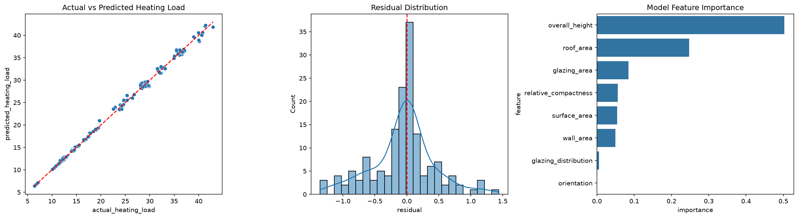
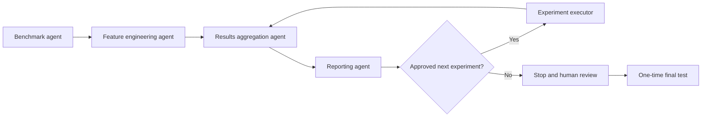

# Evaluation-Driven Recursive AutoML

A controlled multi-agent machine-learning project that predicts building heating load, proposes improvements, evaluates them with cross-validation, and promotes a candidate only when it passes a predefined performance gate.

The project combines my civil-engineering and architectural-domain experience with an evaluation-driven machine-learning workflow.



## Results

| Stage | Model | RMSE | Decision |
|---|---|---:|---|
| Initial champion | Random Forest | 0.5199 | Promoted |
| Domain features | Random Forest | 0.5195 | Rejected |
| RF tuning | Random Forest | 0.5199 | Rejected |
| Alternative model | Extra Trees | 0.4881 | Promoted |
| Final champion | Tuned Extra Trees | **0.4831** | Promoted |

The final champion was evaluated once on the protected test set:

| Metric | Value |
|---|---:|
| MAE | 0.3291 |
| RMSE | 0.4832 |
| R² | 0.9978 |

Cross-validation RMSE (0.4831) and test RMSE (0.4832) were nearly identical. See the [full project report](outputs/reports/final_project_report.md) for experiment history, diagnostics, limitations, and interpretation.

## Why this is recursive

The system repeats a controlled feedback cycle:



The reporting agent reads the complete experiment history and recommends the next approved action. Results are fed back into the aggregated state, so each iteration starts from the current champion rather than starting over. This is evaluation-driven recursive improvement—not a system that rewrites its own source code.

## Governance safeguards

- The 20% test partition is protected during model selection.
- Experiment agents receive development data only.
- Five-fold shuffled cross-validation is used for selection.
- Mean RMSE is the primary metric; lower is better.
- Promotion requires at least 0.5% improvement.
- Accepted and rejected experiments remain in the history.
- The final test requires an explicit command-line approval flag.
- Existing final metrics prevent accidental repeated test evaluation.

## Repository structure

```text
recursive-automl-learning/
├── data/raw/                 # UCI Energy Efficiency workbook
├── notebooks/                # Optional exploratory notebooks
├── outputs/
│   ├── experiments/          # Agent decisions and experiment history
│   ├── figures/              # EDA and final diagnostic figures
│   ├── final_results/        # Final metrics and feature importance
│   ├── models/               # Generated model (ignored by Git)
│   └── reports/              # Iteration and final reports
├── src/
│   ├── agents/               # Four core agents and experiment agents
│   └── *.py                  # Workflow entry points and analysis scripts
├── tests/                    # Automated checks
├── .gitignore
├── requirements.txt
└── README.md
```

## Dataset

This repository uses the [UCI Energy Efficiency dataset](https://archive.ics.uci.edu/dataset/242/energy%2Befficiency), created by Athanasios Tsanas and Angeliki Xifara (2012), DOI `10.24432/C51307`. It contains 768 simulated building configurations, eight architectural inputs, and two load targets. This project predicts `heating_load`.

The dataset is distributed under CC BY 4.0. If the workbook is absent, download `ENB2012_data.xlsx` from UCI and place it in `data/raw/`.

## Setup on Windows

Open the repository folder in VS Code, then open a PowerShell terminal. Enter these commands one line at a time:

```powershell
python -m venv .venv
Set-ExecutionPolicy -Scope Process -ExecutionPolicy Bypass
.\.venv\Scripts\Activate.ps1
python -m pip install --upgrade pip
pip install -r requirements.txt
python .\src\check_setup.py
python .\src\load_data.py
```

Do not enter these commands inside the Python prompt (`>>>`). If you see `>>>`, type `exit()` first and run the commands in the PowerShell terminal.

## Controlled experiment cycle

These are the commands used to create the recorded experiment history. Run each command only after the previous command succeeds when starting a new experiment state:

```powershell
# Exploration and initial agents
python .\src\explore_data.py
python .\src\run_benchmark_agent.py
python .\src\run_feature_engineering_agent.py
python .\src\run_results_aggregation_agent.py
python .\src\run_reporting_agent.py

# Random Forest tuning cycle
python .\src\run_hyperparameter_tuning_agent.py
python .\src\update_recursive_cycle.py
python .\src\run_reporting_agent.py

# Alternative-model cycle
python .\src\run_alternative_model_agent.py
python .\src\update_alternative_cycle.py
python .\src\run_reporting_agent.py

# Extra Trees tuning cycle
python .\src\run_hyperparameter_tuning_agent.py
python .\src\update_extra_trees_tuning_cycle.py
python .\src\run_reporting_agent.py
```

The last reporting step should recommend `stop_and_review`. This repository preserves the completed experiment state as portfolio evidence, so its duplicate-history safeguards will intentionally stop you from adding the same completed result again.

## Final evaluation

The current repository already contains the one-time protected-test results. Do not delete them simply to obtain a new score.

For a completely fresh reproduction, final evaluation is deliberately a separate, human-approved step:

```powershell
python .\src\final_evaluation.py --approve-final-test
python .\src\analyze_final_model.py
python .\src\generate_final_report.py
```

## Run tests

```powershell
pytest -q
```

## Limitations

- The dataset represents simulated configurations, not operating buildings.
- It is small and does not include climate, occupancy, material, or equipment-schedule variables.
- Impurity-based feature importance can be affected by correlated features.
- The results do not establish causal relationships and do not replace professional energy simulation.